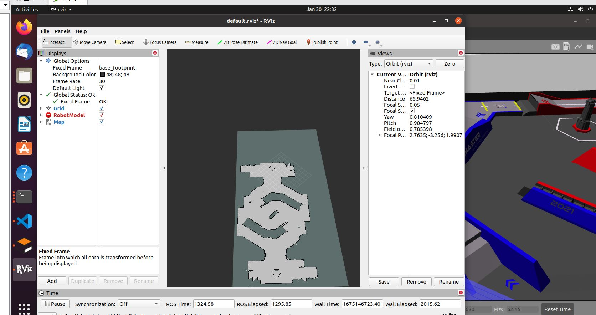

# testTF
--**具体流程如下，即可打开gazebo仿真** 

    catkin_make && source devel/setup.bash or .zsh
    roslaunch testTF test.launch 

### 文件夹内容
    |--testTF
        |--urdf
            |--gazebo
              |--"camera.xarco" #相机在gazebo中的参数,可以用来设定fov以及画面大小
            |--"*.xarco"    #一些urdf的文件,用于描述小车的固定属性,物理属性
        |--worlds
            |--"test.world"  #简单的仿真世界,放置了一个障碍物,体积为0.2*0.5*0.2
        |--scripts
            |--control.py #控制小车在仿真世界中运动        
        |--map
            |--rmuc_2.yaml #已创建好的 rmuc 地图
        |--launch
            |--gazebo.launch #用来启动gazebo以及将小车放入仿真世界中
            |--test_slam.launch  # slam 建图文件,包含gazebo.launch
            |--demo_env.launch #启动gazebo仿真的文件
            |--savemaps.launch #保存地图的文件
            |--readmaps.launch #加载地图的文件
            |--location.launch #定位文件，包含demo_env.launch
            |--path.launch #路径规划文件，寻找导航时的最优路径
            |--navigate.launch #导航文件，包含demo_env.launch , readmaps.launch 和 path.launch 
        |--param 
            |--costmap_common_params.yaml #move_base 在全局路径规划与本地路径规划时调用的通用参数
            |--global_costmap_params.yaml #全局代价地图参数设置
            |--local_costmap_params.yaml  #局部代价地图参数设置
            |--base_local_planner_params.yaml #基本的局部规划器参数配置，这个配置文件设定了机器人的最大和最小速度限制值，也设定了加速度的阈值
        |--rviz
            |--loc.rviz #用于定位的 rviz 文件  
            |--nav.rviz #用于导航的 rviz 文件
        |--src
            |--control.cpp #C++版本的小车控制文件
### 使用topic如下：
  --topic：
    
    /cmd_vel  #控制小车左右旋转移动
    /camera/image_raw  #小车摄像头的图像
    /camera/camera_info #摄像头参数
  --service

    #获取仿真世界中物体的旋转角以及惯性参数,通过model-name区分具体的物体
    /gazebo/model_status  
    #设置仿真世界中物体的旋转角以及惯性参数
    /gazebo/set_model_status  
    
### 脚本介绍

    rosrun testTF *.py #运行控制程序
    
  -- contorl.py 

  通过W,A,D,X来控制小车的前进，左旋，右旋，后退，四个方向。通过OpenCV的waitKey实现对键盘按键的获取。按S可以终止当前状态。

  --showtf.py
  
  待完成，会将物体和小车的仿真世界坐标通过topic的方式发布出来。。

### **2月1日** 新增gmapping建图功能
  在 test_slam.launch 文件中添加了gmapping node，可以通过获取 /scan , 以及里程计坐标 odom , 模型TF , 将地图汇出，
  具体效果如通过 mapserver 保存的图片

 

### **2月16日** 新增locate定位功能和navigate导航功能
  在 location.launch 文件中实现了定位功能。
  在 navigate.launch 文件中实现了导航功能。

### END
#### **PS:** 记得给py文件权限，不然rosrun的时候找不到文件！！
    sudo chmod 777 *.py

**会将建立 urdf 以及 gazebo 控制器添加的文章一同推出**

### 引用
  其中 launch 文件打开的 world，是在开源仓库rm_control所使用的。
 
  地址如下[点击这里](https://github.com/rm-controls/rm_control)
  
# ***-->To Be Continued -->***
      

